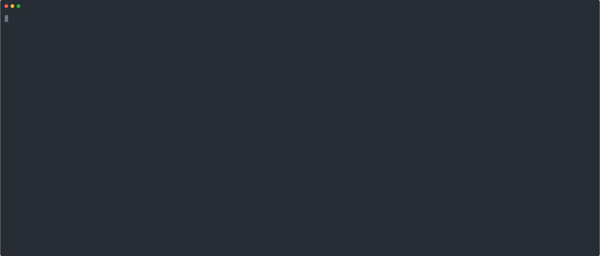

# UmMói

Override TLA+ operators anywhere.

> "Um mói de cana"
> -- Someone drunk at Recife, northeast region of Brazil

It means _a lot_, you can use it to create a lot of TLA+ override operators.

<a href="https://asciinema.org/a/327129"></a>

## Goals
- Easy to configure and use.
- Simple installation, just download the binary for your OS.

## Non-goals
- Performance (if you want it, you should override the operator directly at JVM.
For clojure, check [tla-edn](https://github.com/pfeodrippe/tla-edn)).

## Installation

``` shell
# only works with Linux at the moment. OSX and Windows support help needed o/
$ curl -s https://raw.githubusercontent.com/pfeodrippe/ummoi/master/install -o install-ummoi
$ chmod +x install-ummoi && ./install-ummoi
```

## Usage

**UmMói** first checks for a `ummoi.edn` or `ummoi.json` configuration file at the
directory where you run the `um` command.

It's a GraalVM compiled binary, but you must have Java to run the spec with TLC.

Configuration file examples are below.

EDN
``` clojure
{:spec-file "example.tla" ;; name of the file
 :operators               ;; operators to be overriden (a map of operators name to options)
 {"TransferMoney"         ;; name of the operator in the TLA+ spec
  {:module "example"      ;; name of the module
   :args [self vars]      ;; arguments to the operator
   :run {:type :http-post ;; type of the command to be run (:http-post or :shell are allowed)
         :endpoint "http://localhost:5000"}}}}
```

JSON (the same meaning as the fields at the EDN file)
``` json
{
    "spec-file" : "example.tla",
    "operators" : {
        "TransferMoney" : {
            "module" : "example",
            "args" : [ "self", "vars" ],
            "run" : {
                "type" : "shell",
                "command" : [ "./example_using_env.py" ]
            }
        }
    }
}
```

## CLI options
- `-c $FILE`  pass a configuration file as a path
- `--verbose` verbose mode

## Examples

Check `examples` directory.

### Python 3 web server

Install flask and run `um`.

``` shell
$ pip3 install flask
$ FLASK_APP=examples/example_using_rest.py python3 -m flask run
# in another terminal
$ cd examples && um # or `um -c examples/ummoi.edn`
```

### Python 3 script

You can use `json` files instead of `edn`.

``` shell
$ um -c examples/py_env.json
```

### Babashka web server

Check https://github.com/borkdude/babashka/ and download babashka.

``` shell
$ bb examples/example_bb.clj
# in another terminal
$ um -c examples/bb.edn
```

## Todo (by me or by you)
- [ ] Add windows support
- [ ] Add OSX release
- [ ] Add CI to build releases automatically
